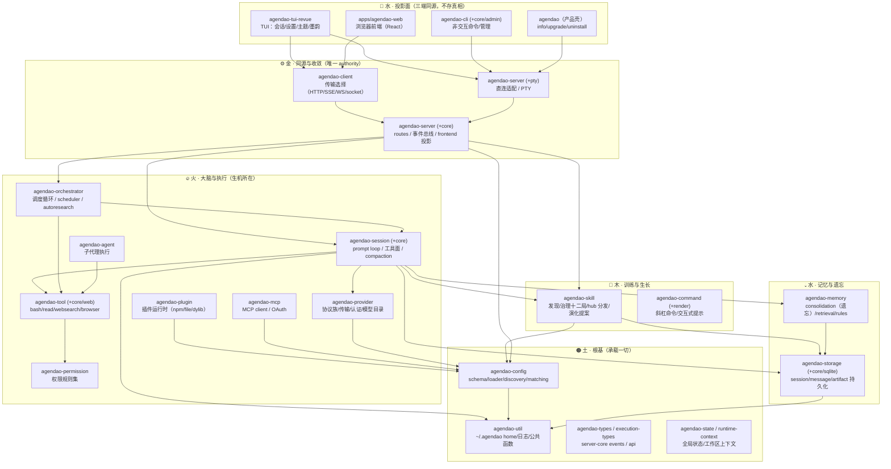
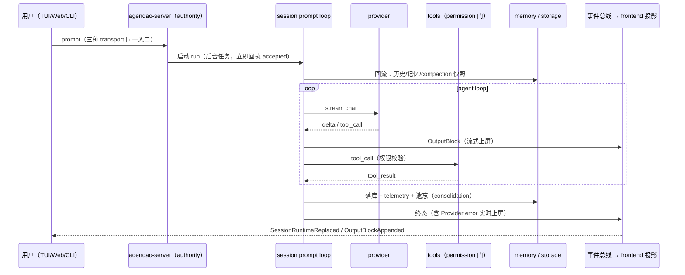

# AgenDao 架构图（五行视角 · 结构简）

> 目标不是器官少，而是**每个器官职责单一、共享同一条气血（事件总线 / authority）**。
> 本文是模块连接关系与功能清单的单一权威图，新增模块时同步更新。

## 一、总图：五行分层与连接关系

## 二、气血循环：一次 prompt 的完整流转

要点：错误与成功**同路同权**——任何失败都在发生时经事件总线实时投影，不允许"只落库不上屏"。

## 三、模块功能详表

### 土 · 根基（被依赖，不依赖他人）

| 模块 | 功能 |
|------|------|
| `agendao-util` | `agendao_home()` 单点权威（AGENDAO_HOME 优先）+ 首启迁移；日志初始化；truncate_chars/strip_ansi 等公共函数；timeout/defer/lock 小件 |
| `agendao-config` | 分层配置加载（全局→项目→.agendao→企业）；schema 与 merge；skills/plugins/commands 发现；`matching`（启停通配）；`disabled_tools/plugins/skills.disabled` 过滤语义 |
| `agendao-types` | session/message/usage/telemetry 等核心类型 |
| `agendao-execution-types` | 执行面共享类型 |
| `agendao-server-core` | canonical `ServerEvent`、runtime control 与唯一 frontend event 投影契约 |
| `agendao-api` | 前后端共享 API 类型（client 经此与 server 对齐） |
| `agendao-state` | global-state.json（最近模型等用户态） |
| `agendao-runtime-context` | 工作区上下文解析（wellknown/workspace identity） |

### 火 · 大脑与执行

| 模块 | 功能 |
|------|------|
| `agendao-provider` | OpenAI Responses、OpenAI Chat Completions、Anthropic Messages；传输与 connect timeout；auth.json（0600）；模型 catalog 缓存 |
| `agendao-session` | scheduler-native prompt/session 生命周期；工具面（Progressive capability 门面化）；instruction 加载（~/.agendao/AGENTS.md 优先）；**遗忘**：compaction 压缩上下文 |
| `agendao-orchestrator` | 唯一 SchedulerBlueprint validator/selector/engine、唯一 AgentLoop、typed execution events |
| `agendao-tool` | 内置工具 registry（bash/read/edit/skill_manage 等）；启停过滤（含门面豁免） |
| `agendao-tool-core` | Tool trait 与 schema |
| `agendao-tool-web` | websearch（内置，直连 exa MCP 端点）/webfetch/browser_session；SSRF 防护 + 测试逃生门 |
| `agendao-mcp` | MCP server 连接/工具注册；OAuth（mcp-auth.json 0600）；启停（Enabled 变体） |
| `agendao-agent` | Agent 身份、配置与 catalog registry；拓扑执行由 SchedulerEngine 负责 |
| `agendao-plugin` | 插件运行时（npm/file/dylib/subprocess）；hook 触发 |
| `agendao-permission` | 权限规则集（bash 命令解析、~/ 展开） |
| `agendao-lsp` | LSP 集成 |
| `agendao-grep` | ripgrep 封装 |
| `agendao-multimodal` | 附件/图像/语音能力与 explain；Web 端录音通过 MediaRecorder 接入 |

### 木 · 训练与生长

| 模块 | 功能 |
|------|------|
| `agendao-skill` | skill 发现（agendao_home 优先）；治理十二局（composition/audit/distribution/sync/relationships/evolution/semantic/index/store/write/guard/mod）；hub 搜索/安装；演化提案与语义冲突；启停过滤 |
| `agendao-command` | 斜杠命令注册/解析/渲染；内置命令（init/review/commit/test/autoresearch 系列）；interactive 提示（自 command-runtime 迁回） |
| `agendao-command-render` | `agendao-command` 的终端渲染兼容 facade（terminal presentation/live semantic consumer） |

### 水 · 记忆与遗忘

| 模块 | 功能 |
|------|------|
| `agendao-memory` | memory consolidation（**遗忘**：合并/衰减/过期）；retrieval 回流；rule hits |
| `agendao-storage` | facade + repositories（session/message/artifact/telemetry）；sqlite 装配与迁移 |
| `agendao-storage-core` | StorageBackend trait |

### 金 · 同源与收敛

| 模块 | 功能 |
|------|------|
| `agendao-server` | 全部 HTTP/WS/SSE routes；事件总线；frontend 投影（ServerEvent→FrontendEvent）；worktree（白名单校验）；PTY WS（Origin 校验） |
| `agendao-server-core` | server 共享状态/事件类型 |
| `agendao-server`（routes/session/local_api.rs）+ `agendao-server-pty` | 直连适配（local_* API：session/skills/MCP/config……）；PTY 独立成 crate |
| `agendao-server-pty` | PTY spawn |
| `agendao-client` | 传输选择器（HTTP/SSE/WS/unix socket） |

### 水 · 投影面（不存真相，只呈现）

| 模块 | 功能 |
|------|------|
| `agendao-tui-revue` | TUI：会话树/设置全分类（General/Model/Skills/MCP/Tools/Keybindings/About）/主题（宋代色系）/墨韵 spinner |
| `apps/agendao-web` | 浏览器前端：会话/composer/execution/settings-drawer（全 i18n） |
| `agendao-cli` | 非交互命令（run/session/skill/debug） |
| `agendao-cli-core` | clap 定义 |
| `agendao-cli-admin` | admin handler（177 行，可并入 core） |
| `agendao`（产品壳） | default-run 主入口；info/upgrade/uninstall；内嵌 web 资源 |
| `agendao-launcher` | 启动器 + web 资源内嵌构建 |

## 四、结构简的三条铁律（对应近期治理）

1. **单点权威（土）**：任何用户数据只在 `~/.agendao`，任何状态只有一个 authority 写、其余都是投影。
2. **同路同权（火）**：错误/失败与成功走同一事件通道实时上屏，不许静默。
3. **生灭有序（木/水）**：skills/tools/plugins/MCP 皆可启停（`disabled*` + `类目/*` 通配），记忆有 consolidation 遗忘——只生不灭的系统是肿瘤。

## 五、工具面与权限边界

- 模型工具面固定以 `capability`、`bash`、`read`、`apply_patch`、`grep` 为五个核心（仍须与 agent hard policy 取交集）。Tool、MCP 和 skill 所需工具进入同一 capability authority；大目录不会把全部 schema 发给 provider。
- scheduler 每个 agent node 的动态工作集最多 16 个工具、序列化 schema 最多 32 KiB。顺序为五核心、skill `requires_tools`、显式 pinned、任务语义候选；完整 allowlist 只留在本地，供 `capability` 发现和调用。
- `capability` 的可见性不授予执行权。`search`、`describe`、`call` 使用同一份 agent/policy target allowlist，猜中隐藏工具名也不能绕过。
- session permission mode 是 typed contract：`default` 保持逐请求治理；`trusted_workspace` 只自动批准明确落在 `workspace:/` scope 的读取和写入；`unsandboxed_yolo` 明确表示本 session 对宿主机执行全开。当前 shell 不是 OS sandbox，因此禁止把后者标成 sandbox YOLO。
- shell session grant 使用规范化 argv 前缀（可执行文件 + 首个参数）。例如 `cargo test --workspace` 可复用 `cmd:cargo/test`，但不会覆盖 `cargo clean`；`git status` 也不会覆盖 `git reset`。
